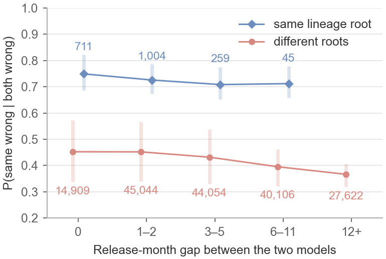
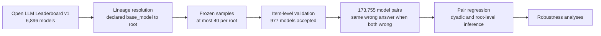
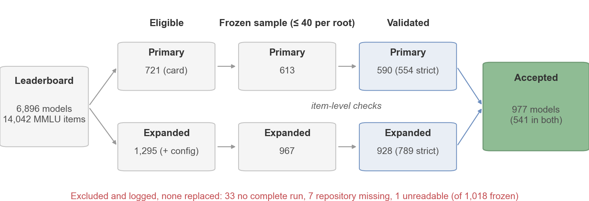
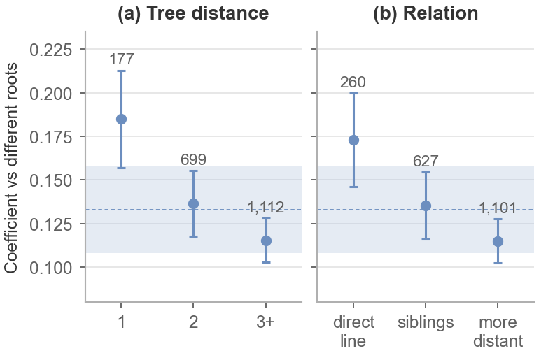
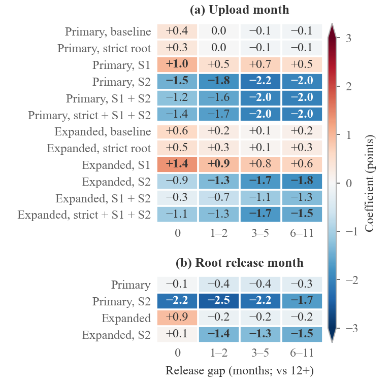
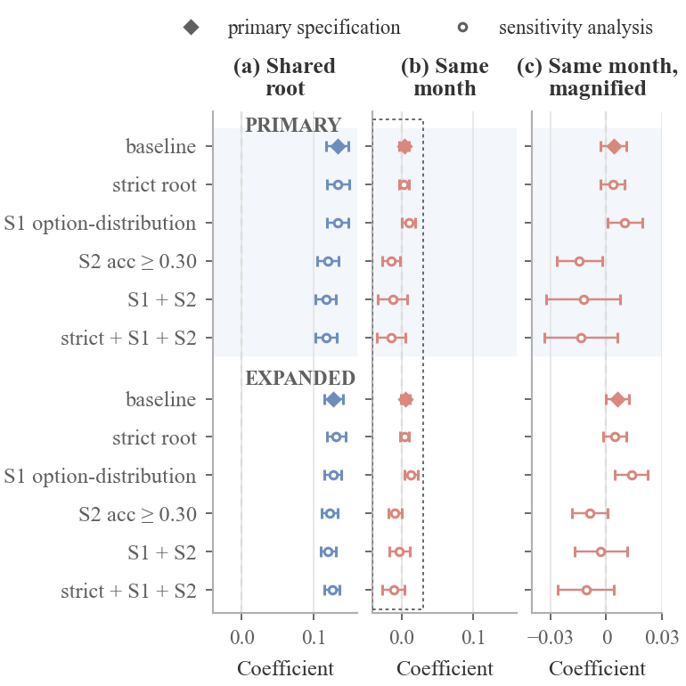
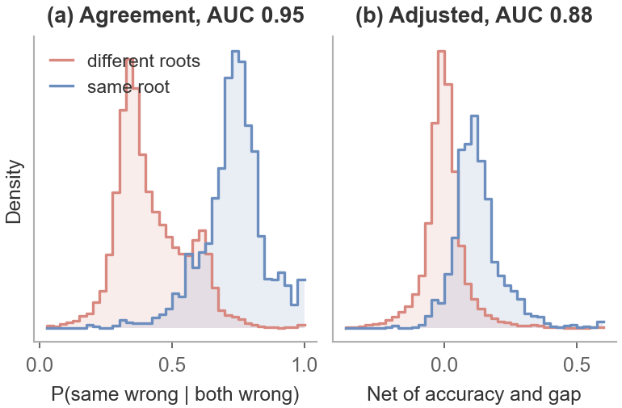
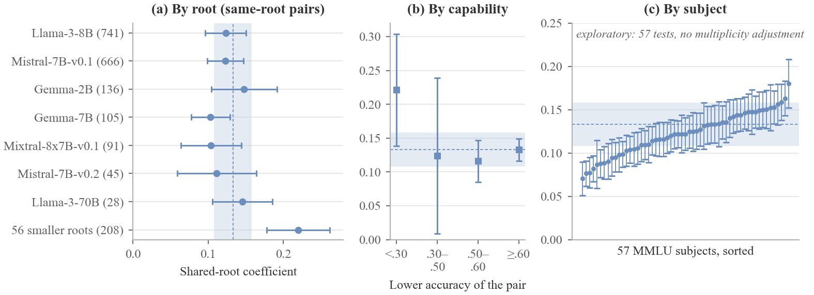

<div align="center">

# Lineage or Era?

### Correlated Errors in Open-Weight Language Models

**A pair-level study of Open LLM Leaderboard models: 977 validated models in two overlapping samples (primary: 590 models, 173,755 pairs)**

[](paper/build/ieee_access_manuscript.pdf)
[](paper/build/supplement.pdf)
[](paper/build/ieee_access_manuscript.pdf)
[](pyproject.toml)
[](src/lineage_era)
[]()
[](docs/release/LICENSING_NOTES.md)

<br>



<sub>When two fine-tunes of the same base model both answer an item incorrectly, they choose the same wrong option about three times in four. Unrelated models do so about two times in five, at every release-month gap.</sub>

</div>

---

## Summary

In the primary sample (590 leaderboard entries, 563 distinct repositories; 173,755 pairs), models descended from the same declared base model choose the same wrong answer **13.3 percentage points** more often than unrelated models of equal accuracy and release gap (delete-one-root jackknife 95% CI 10.8–15.8; pairs weighted equally, so the two largest roots dominate; counting each root once gives larger estimates). In the expanded sample (928 models) the difference is 12.7 points (11.0–14.5). Release proximity shows only small associations once accuracy is controlled, and their sign depends on the specification: same-month pairs agree up to a few points more in several specifications and less among models above 0.30 accuracy. Within this population, lineage is associated with shared wrong answers far more strongly than release timing. The associations are observational.

> The repository name refers to the earlier per-model variance-decomposition study, whose findings are withdrawn. [RESEARCH_STATUS.md](RESEARCH_STATUS.md) says which files belong to the current study and which are kept as history.

## Key Findings

- **Validated data.** For each of 977 models, the correctness status of the reconstructed answer on all 14,042 MMLU items must match the leaderboard's stored correctness flag (this validates correctness, not the specific wrong option); models that fail are excluded and logged.
- **Dose-response (in the plan, run after review).** Agreement increases with closeness of descent: parent–child pairs +18.5 points, distance two +13.6, more distant relatives +11.5; within roots the gradient is smaller but present.
- **Consistency (post hoc).** The association appears separately in each of the seven largest base-model families (10.3–14.8 points) and in all 57 MMLU subjects (model-level intervals). These are re-analyses of the same data, not replications.
- **Release timing.** Unadjusted, same-month pairs agree 8.7 points more than pairs released a year or more apart; most of this is accounted for by accuracy similarity, which rose steeply over the period. Net of accuracy, same-month associations are a few points or less and change sign across specifications (for example +1.8 points when upload and base-model release month enter together, −1.5 among models above 0.30 accuracy).
- **Lineage signal (exploratory).** A pair's agreement alone separates same-root from different-root pairs with an area under the ROC curve of 0.95; this is descriptive, not a validated lineage detector.
- **Data quality.** The leaderboard lists some models more than once under different names (50 entries resolve to 23 repositories) and includes models that give one answer letter to almost every item. Neither affects the conclusions.
- **Influence and developer checks (post hoc).** Removing the two largest roots raises the estimate to 16.0 points; controlling for a shared uploader account leaves 12.9 points.
- **Pre-specified design.** The analysis, sample rules and a simulation check were fixed before any pairwise outcome was computed (the populations, cap and two sensitivity analyses through dated amendments; timing recorded by commit times); every later analysis is labelled as exploratory or post hoc.

---

## Motivation

Majority voting, model routing and multi-model review all assume that the combined models make different mistakes. When two models share a failure mode, their agreement provides less independent evidence than it appears to.

Two explanations for shared errors are commonly proposed:

| | Lineage | Era |
|---|---|---|
| Mechanism | A fine-tune inherits its base model's parameters and, plausibly, its errors | Models built in the same period share data, training recipes and base models |
| Implication if dominant | Diversify base models | Diversify release periods |
| Finding | Strong and graded | Small and specification-dependent once accuracy is controlled |

The two are entangled because a fine-tune is always released after its base model, so they must be estimated jointly.

## Method



For every pair of models, the outcome is the probability that both choose the same wrong option on items both answer incorrectly. It is regressed on:

- a **shared lineage root** indicator, from Hugging Face `base_model` declarations;
- **release-month gap** bins (0, 1–2, 3–5, 6–11 months; 12 or more as reference);
- the sum and difference of the two models' **accuracies**.

Because every model appears in many pairs, inference uses dyadic cluster-robust standard errors and a delete-one-root jackknife.

<details>
<summary><b>Sample construction</b></summary>
<br>

</details>

---

## Results

<table>
<tr>
<td width="50%" align="center"><b>Lineage dose-response</b><br></td>
<td width="50%" align="center"><b>Release-gap coefficients under two timing measures</b><br></td>
</tr>
<tr>
<td align="center"><b>Twelve analyses fixed before any pair outcome</b><br></td>
<td align="center"><b>Agreement as a signal of shared lineage</b><br></td>
</tr>
</table>

<p align="center"><b>Heterogeneity by root, capability and subject</b><br></p>

### Principal Estimates

| Quantity | Primary sample (590 models, 173,755 pairs) |
|---|---|
| Shared lineage root | **+13.3 points** (jackknife 95% CI 10.8–15.8); 11.7–13.4 across the 12 analyses fixed in advance; counting each root once (post hoc, high between-root heterogeneity): unweighted mean of the 63 per-root estimates 25.3; random-effects (DerSimonian–Laird) pooled estimate over the 16 roots with at least 10 same-root pairs 16.6 (95% CI 12.5–20.8) |
| Dose-response | parent–child +18.5; distance two +13.6; more distant +11.5 |
| Same release month, adjusted for accuracy | +0.4 points (pre-specified model); −2.2 to +3.3 across other primary-sample specifications |
| Same release month, unadjusted | +8.7 points, mostly accounted for by accuracy similarity |
| Item-difficulty-aware nulls | mean excess agreement near zero; lineage contrast unchanged |
| Duplicate and degenerate models removed | +12.8 points |

<details>
<summary><b>Robustness checks</b></summary>

| Check | Shared root | Same month |
|---|---|---|
| Pre-specified model | +0.133 | +0.004 |
| Root-level dyadic standard errors | +0.133 [0.114, 0.152] | +0.004 [−0.004, 0.012] |
| Delete-one-root jackknife | +0.133 [0.108, 0.158] | +0.004 [−0.005, 0.013] |
| Weighted by jointly wrong items | +0.142 | +0.012 |
| Minus answer-letter chance | +0.125 | −0.002 |
| Item-difficulty nulls N1a / N1b | +0.133 / +0.133 | +0.004 / +0.004 |
| With size and architecture controls | +0.126 | +0.007 |
| Timing by base-model release month | +0.131 | −0.001 |
| Configuration-consistent lineage only | +0.135 | +0.000 |
| Cap-15 subset | +0.146 | +0.005 |

Coefficients are differences in probability. Complete tables for all four samples are in the [supplementary material](paper/build/supplement.pdf).
</details>

---

## Installation

```bash
git clone https://github.com/Sudharsanselvaraj/Identifiable-Variance-Decomposition-of-Correlated-Errors-in-Foundation-Models.git
cd Identifiable-Variance-Decomposition-of-Correlated-Errors-in-Foundation-Models
python -m pip install -e ".[test,ollb]"
python -m pytest -m "not slow"   # quick tests; plain `python -m pytest` also runs the two slow optimizer searches
```

Regenerate the tables and figures, then build the paper and supplement. Tables and 14 of the 20 figures need only the committed results; the six figures drawn from pair-level data also need the rebuilt frozen lists and validated answer files (full reproduction below). Without them the script draws the other figures, names the skipped ones and exits with status 1:

```bash
make -C paper tables figures
make -C paper
```

<details>
<summary><b>Full reproduction from the public source</b></summary>

The leaderboard's per-item files declare no licence, so they are regenerated rather than redistributed. Each step verifies its inputs against recorded SHA-256 hashes.

```bash
python scripts/fetch_v1_contents_meta.py      # leaderboard metadata
python -m lineage_era.ollb.roster_v1          # lineage roster
python scripts/rebuild_frozen_lists.py        # frozen samples, checked against recorded hashes
python scripts/compare_rosters.py             # re-draws the samples (seed 0, at most 40 per root); reproduces the recorded hashes
python scripts/download_ollb_v1.py            # reference model first, then the answer files (about 11 GB read)
python scripts/validation_report.py           # per-model validation manifest; the analysis reads only "validated" models
python scripts/run_exp04_final.py             # pre-specified analyses and audits
python scripts/run_exp04_item_null.py         # item-difficulty-aware nulls
python scripts/run_pair_gate_audit.py --population primary --cap 40 --reps 500
python scripts/run_exp04_revision2.py         # timing, dose-response, CAPA and data-quality checks
python scripts/run_exp04_heterogeneity.py     # heterogeneity, lineage detection, descriptives
python scripts/run_exp04_revision3.py         # flexible accuracy, item fixed effects, bootstrap, MMLU-Redux (needs datasets/mmlu_redux/, fetched separately)
python scripts/run_exp04_matched_followup.py  # accuracy-matched pairs: composition and S1 (post hoc)
python scripts/run_exp04_audit_followup.py    # largest-root influence, same-uploader control (post hoc)
make -C paper tables figures && make -C paper
```

On case-insensitive filesystems the 977 validated models occupy 973 answer files: four leaderboard entries differ from another only in letter case and are the same Hub repository. See [`docs/REPRODUCIBILITY_CHECKLIST.md`](docs/REPRODUCIBILITY_CHECKLIST.md) for the environment and seeds.
</details>

<details>
<summary><b>Repository structure</b></summary>

| Path | Contents |
|---|---|
| [`paper/`](paper) | Manuscript and supplement source, figures, generated tables, IEEE class files, compiled PDFs |
| [`src/lineage_era/ollb/`](src/lineage_era/ollb) | Leaderboard pipeline: Hub metadata, lineage resolution, extraction and validation, simulation check, analysis |
| [`src/lineage_era/analysis/`](src/lineage_era/analysis) | Per-model precision analysis (crossed REML, expected information, Monte Carlo) |
| [`scripts/`](scripts) | Entry points for every analysis, table and figure |
| [`results/`](results) | Committed outputs from which every reported number is generated |
| [`datasets/ollb/frozen/`](datasets/ollb/frozen) | Frozen model lists (public versions) |
| [`docs/05_Experiments/`](docs/05_Experiments) | Analysis plan and its three dated amendments |
| [`docs/08_Reviews/`](docs/08_Reviews) | Revision log, including errata |
| [`master/`](master) | Publisher-neutral single-column version, generated from the IEEE source (`make -C master`) |
| [`paper/src/archive/`](paper/src/archive), [`master/archive/`](master/archive) | Superseded 16-model version (withdrawn) |
</details>

---

## Data Availability and Licensing

- **Code.** A licence has not yet been selected; see [`docs/release/LICENSING_NOTES.md`](docs/release/LICENSING_NOTES.md).
- **Leaderboard data.** The per-item details and metadata declare no licence. The derived answer files and three copied metadata fields are therefore not redistributed; the scripts rebuild them from the public source and verify them byte for byte.
- **Included.** Frozen model lists, Hugging Face metadata caches, validation reports and all analysis outputs.

## Limitations

- The results are observational and describe a self-selected population dominated by community fine-tunes released between 2022 and 2024.
- A single benchmark is used (MMLU, four options), scored by the leaderboard's evaluation pipeline.
- Declared lineage may be incorrect; a configuration-file check agrees with the declared root for 74% of the models it could test.
- Ensembles were not evaluated; whether lineage diversity improves voting or routing remains to be tested.
- An earlier per-model evaluation (16 of 20 planned models on one rented A100 GPU) is not used: an extraction error invalidated every per-question output. Sections S2 and S7 of the supplement document it.
- The analysis plan was not registered externally; its timing rests on commit times within a single day.

## Citation

```bibtex
@misc{sudharsan2026lineage,
  title  = {Lineage and Release Timing in Correlated Errors of Open-Weight
            Language Models: A Pair-Level Study},
  author = {Sudharsan S and Kanaga Suba Raja, S. and Shree Harish V and
            Shieh, Chin-Shiuh and Horng, Mong-Fong and Lavanya R},
  year   = {2026},
  note   = {Manuscript in preparation},
  url    = {https://github.com/Sudharsanselvaraj/Identifiable-Variance-Decomposition-of-Correlated-Errors-in-Foundation-Models}
}
```

## Authors

Sudharsan S, S. Kanaga Suba Raja, Shree Harish V, Chin-Shiuh Shieh, Mong-Fong Horng, Lavanya R

Department of Computer Science and Engineering, SRM Institute of Science and Technology, Tiruchirappalli, India
Research Institute of IoT Cybersecurity, National Kaohsiung University of Science and Technology, Kaohsiung, Taiwan

Correspondence: S. Kanaga Suba Raja (kanagass@srmist.edu.in)
