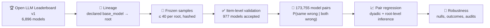

<div align="center">

# 🧬 Lineage or Era?

### Do open-weight language models that share an ancestor make the *same* mistakes?

**A pair-level study of 977 Open LLM Leaderboard models and 173,755 model pairs**

[](paper/build/ieee_access_manuscript.pdf)
[](paper/build/supplement.pdf)
[](paper/build/ieee_access_manuscript.pdf)

[](pyproject.toml)
[](src/lineage_era)
[](docs/REPRODUCIBILITY_CHECKLIST.md)
[]()
[](docs/release/LICENSING_NOTES.md)

<br>


<sub><b>When two fine-tunes of the same base model both get a question wrong, they pick the same wrong answer ~3 times in 4.<br>Unrelated models do so ~2 times in 5, no matter how close together they were released.</b></sub>

</div>

---

## 🔥 TL;DR

> Models descended from the **same base model** choose the **same wrong answer** **13.3 percentage points** more often than unrelated models of equal accuracy (95% CI 10.8–15.8).
> **When** a model was released adds nothing of stable sign once accuracy is accounted for: the primary analysis rules out same-month effects larger than **1.1 points**.
> **Lineage, not release timing, is what ties model mistakes together.**

## ✨ Highlights

- 🧪 **977 models, validated item by item.** Every one of 14,042 MMLU answers per model must reproduce the leaderboard's own correctness flag, or the model is rejected.
- 🌳 **Closer relatives agree more.** Parent–child pairs: **+18.5** points; two steps apart: **+13.6**; more distant: **+11.5**.
- 🧩 **It's everywhere.** Present in each of the **7 largest base-model families** (10.3–14.8 points) and in **all 57 MMLU subjects**.
- 🕰️ **Release timing is a mirage of accuracy.** Unadjusted, same-month models agree 8.7 points more, because accuracy rose steeply over time. Net of accuracy, that gap is gone, whether timing is measured by the model or by its base model.
- 🔍 **Agreement reveals lineage.** A pair's agreement alone flags shared ancestry with **AUC 0.95**.
- 🧹 **Leaderboard data quality.** We found renamed models listed twice (50 entries → 23 repositories) and models answering one letter to almost everything; neither drives the results.
- 📐 **Plan fixed before outcomes.** Analysis, sample rules and a simulation check were written down before any pairwise result was computed, and every deviation is labelled.

---

## 🎯 Why this matters

Majority votes, routers and "ask a second model" review steps all assume that models make **different** mistakes. If two models share a blind spot, their agreement is false reassurance.

Two explanations compete for why models fail together:

| | 🌳 **Lineage** | 🕰️ **Era** |
|---|---|---|
| **Idea** | A fine-tune inherits its base model's weights, and its blind spots | Models built at the same time share the same data, recipes and fashions |
| **If it dominates** | Diversify **base models** | Diversify **release dates** |
| **What we find** | ✅ Strong, graded, everywhere | ❌ No stable association net of accuracy |

The two are entangled, since a fine-tune always comes after its base, which is why this needs a careful design.

## 🔬 How it works



For every pair of models we measure how often they choose the **same wrong option when both are wrong**, then ask how that depends on:

- **shared lineage root** (from Hugging Face `base_model` declarations), and
- **release-month gap**,

holding both models' **accuracies** fixed. Because each model appears in many pairs, uncertainty is estimated with **dyadic cluster-robust** errors and a **delete-one-root jackknife**.

<details>
<summary><b>📦 Where the 977 models come from</b></summary>
<br>

</details>

---

## 📊 Results

<table>
<tr>
<td width="50%" align="center"><b>🌳 Closer relatives agree more</b><br></td>
<td width="50%" align="center"><b>🕰️ Release timing: flat under both measures</b><br></td>
</tr>
<tr>
<td align="center"><b>📐 Twelve pre-specified analyses agree</b><br></td>
<td align="center"><b>🔍 Agreement reveals lineage (AUC 0.95)</b><br></td>
</tr>
</table>

<p align="center"><b>🧩 Every big family, every subject</b><br></p>

### Numbers at a glance

| | Primary sample (590 models · 173,755 pairs) |
|---|---|
| 🌳 Shared lineage root | **+13.3 pts** (jackknife 95% CI 10.8–15.8); 11.7–13.4 across 12 pre-specified analyses |
| 🧬 Dose-response | parent–child **+18.5** · distance 2 **+13.6** · distant **+11.5** |
| 🕰️ Same release month (net of accuracy) | **+0.4 pts**; 90% interval excludes effects above **1.1 pts** |
| 🕰️ Same release month (unadjusted) | +8.7 pts, explained by accuracy similarity |
| 🎲 Item-difficulty nulls | average excess agreement ≈ 0, lineage contrast **unchanged** |
| 🧹 Duplicates and degenerate models removed | +12.8 pts |

<details>
<summary><b>🧪 Every robustness check (click to expand)</b></summary>

| Check | Shared root | Same month |
|---|---|---|
| Pre-specified model | +0.133 | +0.004 |
| Root-level dyadic SEs | +0.133 [0.114, 0.152] | +0.004 [−0.004, 0.012] |
| Delete-one-root jackknife | +0.133 [0.108, 0.158] | +0.004 [−0.005, 0.013] |
| Weighted by jointly wrong items | +0.142 | +0.012 |
| Minus answer-letter chance | +0.125 | −0.002 |
| Item-difficulty null N1a / N1b | +0.133 / +0.133 | +0.004 / +0.004 |
| + size and architecture controls | +0.126 | +0.007 |
| Timing by base model's release month | +0.131 | −0.001 |
| Config-consistent lineage only | +0.135 | +0.000 |
| Cap-15 subset | +0.146 | +0.005 |

Full tables for all four samples are in the [supplement](paper/build/supplement.pdf).
</details>

---

## ⚡ Quickstart

```bash
git clone https://github.com/Sudharsanselvaraj/Identifiable-Variance-Decomposition-of-Correlated-Errors-in-Foundation-Models.git
cd Identifiable-Variance-Decomposition-of-Correlated-Errors-in-Foundation-Models
python -m pip install -e ".[test,ollb]"
python -m pytest                     # 63 tests
make -C paper tables figures         # every table and figure from committed results
make -C paper                        # paper + supplement PDFs
```

<details>
<summary><b>🔁 Reproduce every number from scratch</b></summary>

The leaderboard's raw per-item files carry no licence, so they are **regenerated** from the public source rather than shipped. Each step verifies its inputs by SHA-256.

```bash
python scripts/fetch_v1_contents_meta.py      # leaderboard metadata (hash-checked)
python -m lineage_era.ollb.roster_v1          # lineage roster
python scripts/rebuild_frozen_lists.py        # frozen samples, must match recorded hashes
python scripts/download_ollb_v1.py            # 977 validated answer files (~11 GB read)
python scripts/validation_report.py           # per-model validation categories
python scripts/run_exp04_final.py             # 12 pre-specified analyses + audits, diffed vs committed outputs
python scripts/run_exp04_item_null.py         # item-difficulty-aware nulls
python scripts/run_pair_gate_audit.py --population primary --cap 40 --reps 500
python scripts/run_exp04_revision2.py         # timing, dose-response, CAPA, data-quality checks
python scripts/run_exp04_heterogeneity.py     # per-root, per-subject, detection, descriptives
make -C paper tables figures && make -C paper
```

Details: [`docs/REPRODUCIBILITY_CHECKLIST.md`](docs/REPRODUCIBILITY_CHECKLIST.md)
</details>

<details>
<summary><b>🗂️ Repository map</b></summary>

| Path | What's inside |
|---|---|
| [`paper/`](paper) | Manuscript and supplement source, figures, generated tables, IEEE class files, compiled PDFs |
| [`src/lineage_era/ollb/`](src/lineage_era/ollb) | Leaderboard pipeline: Hub metadata, lineage, extraction and validation, simulation check, analysis |
| [`src/lineage_era/analysis/`](src/lineage_era/analysis) | Per-model precision analysis (crossed REML, expected information, Monte Carlo) |
| [`scripts/`](scripts) | Entry points for every analysis, table and figure |
| [`results/`](results) | Committed outputs that every reported number comes from |
| [`datasets/ollb/frozen/`](datasets/ollb/frozen) | Frozen model lists (public versions) |
| [`docs/05_Experiments/`](docs/05_Experiments) | Analysis plan and its three dated amendments |
| [`docs/08_Reviews/`](docs/08_Reviews) | Revision log, including errata |
| [`paper/src/archive/`](paper/src/archive), [`master/`](master) | Superseded 16-model version (withdrawn) |
</details>

---

## ⚖️ Data and licensing

- 📦 **Code:** a licence has not yet been chosen ([notes](docs/release/LICENSING_NOTES.md)).
- 🚫 **Leaderboard per-item data:** declares no licence, so the derived answer files and three copied metadata fields are **not redistributed**. Scripts rebuild them from the public source and check them byte for byte.
- ✅ **Included:** frozen model lists, Hub metadata caches, validation reports and all analysis outputs.

## ⚠️ Limitations (the honest part)

- 🔗 **Association, not causation.** The data come from a self-selected population dominated by community fine-tunes from 2022–2024.
- 📏 **One benchmark** (MMLU, 4 options), scored by the leaderboard's own evaluation pipeline.
- 🏷️ **Declared lineage can be wrong.** A config-file check agrees with the declared root for 74% of testable models.
- 🧪 **No ensembles were tested.** Whether lineage diversity improves voting or routing is the next experiment.
- 🕳️ **An earlier version of this project was withdrawn.** Its 16-model results came from an extraction bug; see Section S2 of the supplement.

## 📝 Citation

```bibtex
@misc{sudharsan2026lineage,
  title  = {Lineage and Release Timing in Correlated Errors of Open-Weight
            Language Models: A Pair-Level Study},
  author = {Sudharsan S and Kanaga Suba Raja, S. and Shree Harish V and
            Shieh, Chin-Shiuh and Horng, Mong-Fong and Lavanya R},
  year   = {2026},
  note   = {Manuscript in preparation},
  url    = {https://github.com/Sudharsanselvaraj/Identifiable-Variance-Decomposition-of-Correlated-Errors-in-Foundation-Models}
}
```

## 👥 Authors

**Sudharsan S** · **S. Kanaga Suba Raja** · **Shree Harish V** · **Chin-Shiuh Shieh** · **Mong-Fong Horng** · **Lavanya R**

SRM Institute of Science and Technology, Tiruchirappalli, India · National Kaohsiung University of Science and Technology, Taiwan

<div align="center">
<br>
<sub>If this work is useful to you, ⭐ the repository.</sub>
</div>
